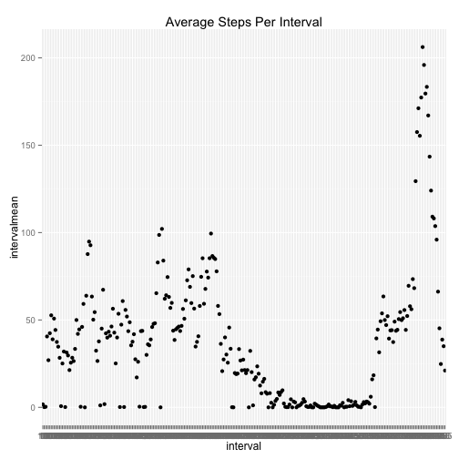

# Reproducible Research: Peer Assessment 1


## Loading and preprocessing the data

```r
activity <- read.csv("activity.csv", header = TRUE)
```


## What are the mean and median total number of steps taken per day?

```r
daysum <- tapply(activity$steps, activity$date, sum, na.rm = TRUE)
daysum <- as.data.frame(daysum)
daymean <- mean(daysum$daysum)
daymedian <- median(daysum$daysum)
```


### Mean total number of steps taken per day: 9354.2295
### Median total number of steps taken per day: 10395


## What is the average daily activity pattern?

```r
intervalmean <- tapply(activity$steps, activity$interval, mean, na.rm = TRUE)
intervalmean <- as.data.frame(intervalmean, row.names = NULL)
intervalmean$interval <- rownames(intervalmean)
library(ggplot2)
qplot(interval, intervalmean, data = intervalmean, main = "Average Steps Per Interval")
```

 


```r
sorted <- (intervalmean[order(intervalmean[, 1], decreasing = TRUE), ])
interval <- sorted[1, 2]
stepavg <- sorted[1, 1]
```


### The interval with the highest average number of steps is 835 with an average number of steps of 206.1698.


## Imputing missing values


## Are there differences in activity patterns between weekdays and weekends?


